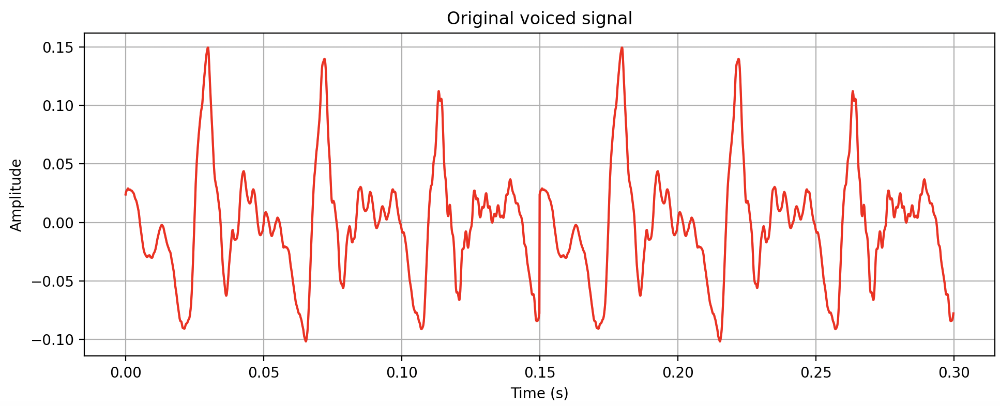
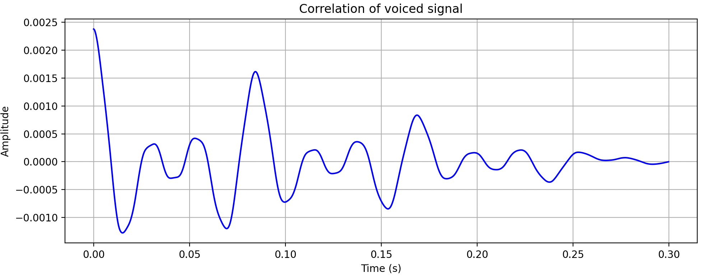
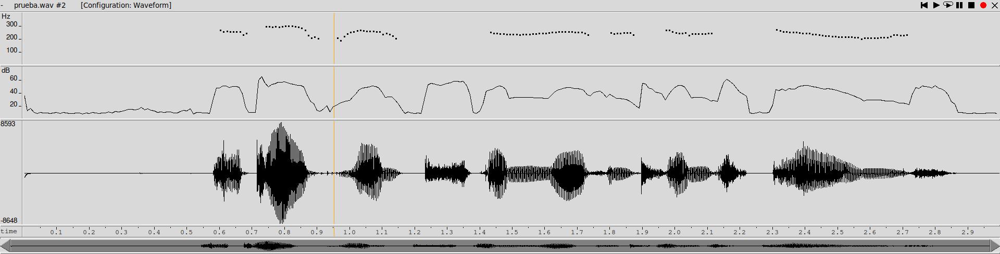
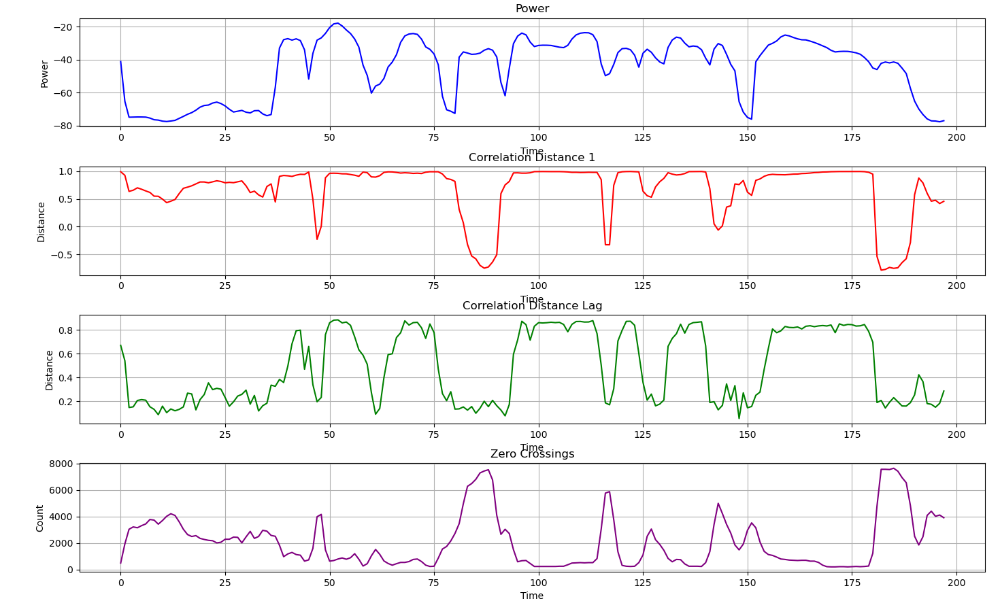
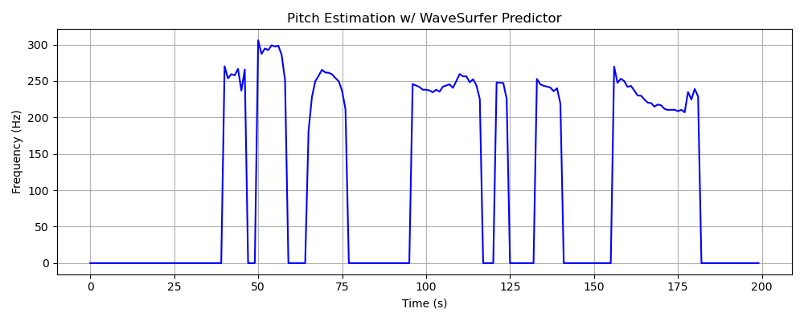
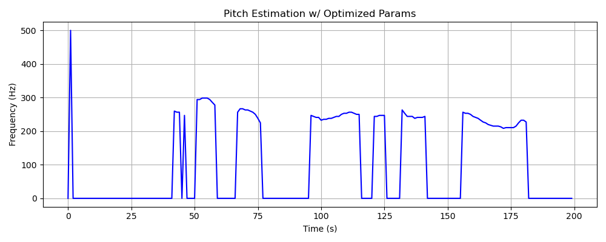
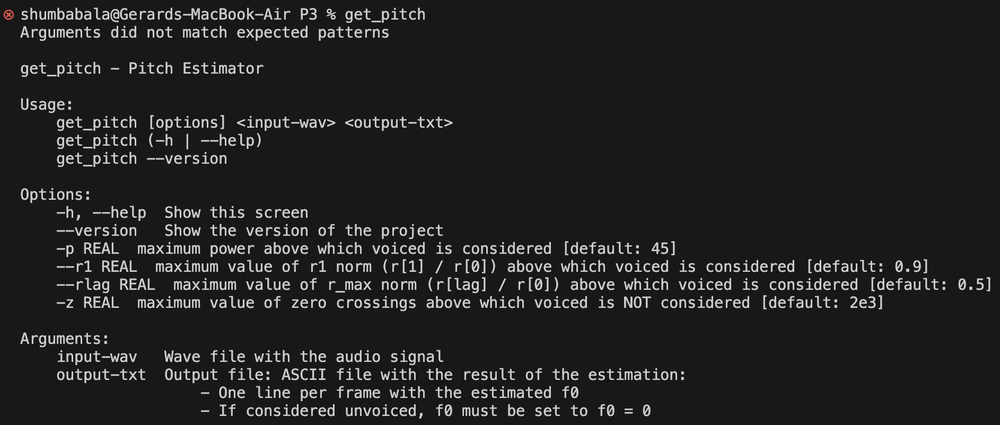
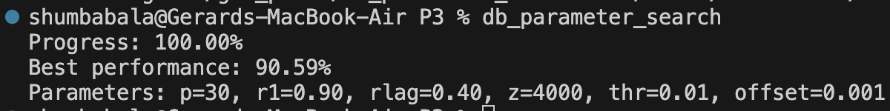

PAV - P3: estimación de pitch
=============================

Esta práctica se distribuye a través del repositorio GitHub [Práctica 3](https://github.com/albino-pav/P3).
Siga las instrucciones de la [Práctica 2](https://github.com/albino-pav/P2) para realizar un `fork` de la
misma y distribuir copias locales (*clones*) del mismo a los distintos integrantes del grupo de prácticas.

Recuerde realizar el *pull request* al repositorio original una vez completada la práctica.

Ejercicios básicos
------------------

- Complete el código de los ficheros necesarios para realizar la estimación de pitch usando el programa
  `get_pitch`.

   * Complete el cálculo de la autocorrelación e inserte a continuación el código correspondiente.

   ```cpp
   void PitchAnalyzer::autocorrelation(const vector<float> &x, vector<float> &r) const
  {

    for (unsigned int l = 0; l < r.size(); ++l)
    {
      /// \TODO Compute the autocorrelation r[l] <-- DONE IN LAB
      /// \FET Autocorrelacio COMPLETE
      r[l] = 0;
      for (unsigned int n = l; n < x.size(); ++n)
      {
        r[l] += x[n] * x[n - l];
      }
      r[l] /= x.size();
    }

    if (r[0] == 0.0F) // to avoid log() and divide zero
      r[0] = 1e-10;
  }
  ```

   * Inserte una gŕafica donde, en un *subplot*, se vea con claridad la señal temporal de un segmento de
     unos 30 ms de un fonema sonoro y su periodo de pitch; y, en otro *subplot*, se vea con claridad la
	 autocorrelación de la señal y la posición del primer máximo secundario.

	 NOTA: es más que probable que tenga que usar Python, Octave/MATLAB u otro programa semejante para
	 hacerlo. Se valorará la utilización de la biblioteca matplotlib de Python.

   <small>Para hacer un primer análisis de un tramo de señal de 30 ms que contiene información sonora teniamos que saber la trama que escoger. Para eso vimos que la trama número 193 contiene información de pitch (y que por lo tanto es sonoro), pues extraímos esos 30 ms de muestras y obtuvimos las siguiente representación:</small>

   

   <small>Veamos ahora la autocorrelación de este tramo sonoro justo arriba:</small>

   

   * Determine el mejor candidato para el periodo de pitch localizando el primer máximo secundario de la
     autocorrelación. Inserte a continuación el código correspondiente.

     <small>Este es el código que usamos para detectar el período de pitch en función del primer máximo de la autocorrelación después del origen, por supuesto. Tanto iRMax como iR son iteradores que apuntan a valores del señal de autocorrelación. También hay que realizar la búsqueda dentro de un rango determinado de posiciones del vector, que vienen delimitadas por los valores de npitch_min y npitch_max:</small>

     ```cpp
     for (iRMax = iR = r.begin() + npitch_min; iR < r.begin() + npitch_max; ++iR) //<--implemented in lab
    {
      if (*iR > *iRMax)
      {
        iRMax = iR;
      }
    }
    ```

   * Implemente la regla de decisión sonoro o sordo e inserte el código correspondiente.

   <small>Dicha implementación se realiza en el método **unvoiced** de **PitchAnalyser**, y a continuación vemos la implementación en código:</small>

   ```cpp
   bool PitchAnalyzer::unvoiced(float pot, float r1norm, float rmaxnorm, int zcr) const
  {
    if ((pot <= max_power && r1norm >= r1norm_max) || (rmaxnorm >= rmaxnorm_max && zcr <= zcr_max))
    {
      return false;
    }
    else
    {
      return true;
    }
  }
  ```

  <small>Una pequeña cosa a comentar es que se implementa la condición **pot <= max_power** porque la potencia es logaritmica y por lo tanto cuanto más pequeño sea (en negativo, cerca del zero) más probabilidad de que sea sonoro, mientras que valores más negativos (tirando para más bajor de -50/-60) son casi ciertamente tramos sordos.</small>

   * Puede serle útil seguir las instrucciones contenidas en el documento adjunto `código.pdf`.

- Una vez completados los puntos anteriores, dispondrá de una primera versión del estimador de pitch. El 
  resto del trabajo consiste, básicamente, en obtener las mejores prestaciones posibles con él.

  * Utilice el programa `wavesurfer` para analizar las condiciones apropiadas para determinar si un
    segmento es sonoro o sordo. 
	
	  - Inserte una gráfica con la estimación de pitch incorporada a `wavesurfer` y, junto a ella, los 
	    principales candidatos para determinar la sonoridad de la voz: el nivel de potencia de la señal
		(r[0]), la autocorrelación normalizada de uno (r1norm = r[1] / r[0]) y el valor de la
		autocorrelación en su máximo secundario (rmaxnorm = r[lag] / r[0]).

		Puede considerar, también, la conveniencia de usar la tasa de cruces por cero.

    <small>Con WaveSurfer fuimos capaces de realizar un análisis del pitch, como se ve en la captura a continuación. Esta información nos sirvió como información preliminar para poder capturar cuales son algunas de las propiedades del señal más importantes a la hora de predecir la presencia de pitch. Como veremos más a continuación, dicho análisis fue expandido haciendo uso de **matplotlib** de **python** donde se esbozó y analizó la importancia de otros parámetros como los `zero crossings` o distintos `lags` de la autocorrelación:</small>

    

    <small>Ahora, antes de visualizar los gráficos de análisis de propiedades del señal, vamos a mostrar un par de funciones que definimos para realizar dicho análisis. Así ha sido nuestra implementación de la función **sgn** y **compute_zcr** en C++:</small>

    ```cpp
    int sgn(float x)
  {
    if (x > 0.0)
      return 1;
    else if (x < 0.0)
      return -1;
    else
      return 0;
  }

  int PitchAnalyzer::compute_zcr(std::vector<float> &x) const
  {
    int sum = 0;
    for (int i = 0; i < x.size(); i++)
    {
      if (sgn(x[i]) != sgn(x[i - 1]))
      {
        sum++;
      }
    }
    return (int)samplingFreq / (2 * (x.size() - 1)) * sum;
  }
  ```

  <small>No olvidar que también hay que añadir el código correspondiente al fichero **.h**.
  
  Si nos fijamos en la siguiente 4 propiedades de la señal de audio, podemos tener una mejor idea de cuales son más útiles en cuanto a su utilización para la detección de presencia de sonoridad y consecuentemente de pitch. Es un concepto muy relacionado con la P2 donde se implementó el VAD teniendo en cuenta algunas de estas propiedades del señal de voz. En concreto las 4 propiedades son:
  
    * Potencia
    * r[1] (autocorrelación a distancia 1)
    * r[lag] (autocorrelación a distancia del primer máximo fuera del origen)
    * zcr (zero crossing rate)</small>

    

	    Recuerde configurar los paneles de datos para que el desplazamiento de ventana sea el adecuado, que
		en esta práctica es de 15 ms.

      - Use el estimador de pitch implementado en el programa `wavesurfer` en una señal de prueba y compare
	    su resultado con el obtenido por la mejor versión de su propio sistema.  Inserte una gráfica
		ilustrativa del resultado de ambos estimadores.
     
		Aunque puede usar el propio Wavesurfer para obtener la representación, se valorará
	 	el uso de alternativas de mayor calidad (particularmente Python).

    <small>A continuación vemos una comparación de 2 gráficas (basadas en nuestro fichero de prueba de confianza `prueba.f0`), la primera siendo un **plot** del pitch de referencia (extraído de WaveSurfer) y la segunda otro **plot** pero esta vez del pitch estimado con nuestro estimador (con los mejores parámetros extraídos por el programa `parameter_search`, que en este caso ha sido:
    
      * Potencia = 40
      * r[1] = 0.6
      * r[lag] = 0.6
      * zcr = 1300)</small>

    

    <center>Extracted WaveSurfer Pitch</center>

    

    <center>Predictor Predicted Pitch</center>
  
  * Optimice los parámetros de su sistema de estimación de pitch e inserte una tabla con las tasas de error
    y el *score* TOTAL proporcionados por `pitch_evaluate` en la evaluación de la base de datos 
	`pitch_db/train`..

  <small>Hemos realizado una búsqueda exaustiva por toda una red de parámetros candidatos mediante un programa **C++** adicional llamado `parameter_search.cpp` (su código puede encontrarse en `src/`, aunque a lo largo de la implementación se ha cambiado de distinta verisón, es decir, el que está ahora subido puede que no sea el que se usó para encontrar estos resultados que ahora siguen). Si lo ejecutamos primero para optimizar el fichero de prueba `prueba.wav`, obtenemos la siguiente salida:</small>

  ```console
  shumbabala@Gerards-MacBook-Air P3 % parameter_search
  Progress: 100.00%
  Best performance: 91.80%
  Parameters: p=25, r1=0.60, rlag=0.60, z=1300
  ```

  <small>Como puede observarse, se ha hecho una llamada al binario `parameter_search` cuya ejecución tardó alrededor de 5-10 minutos.
  
  Ahora bien, si realizamos la optimización para toda la database de ficheros **wav**, obtenemos los siguientes parametros. Tener en cuenta que ahora solo optimizamos los parámetros básicos (no hemos llegado aún a la ampliación)</small>

  ```console
  shumbabala@Gerards-MacBook-Air P3 % db_parameter_search
  Progress: 100.00%
  Best performance: 89.43%
  Parameters: p=25, r1=0.90, rlag=0.40, z=1500
  ```

<small>Este score se encontró realizando una ejecución iterativa del programa `run_get_pitch.sh` cada vez con parámetros distintos (de una red de posibles parámetros), es decir, un mecanismo muy parecido al empleado para detectar la mejor combinación de parámetros con el fichero de prueba anterior. El código **C++** empleado para realizar esté análisis de todos los ficheros de la databse se encuentra en `src/get_pitch/db_parameter_search.cpp`. Como dicho anteriormente, la versión actual de este fichero no tiene porque ser la versión que se usó para generar este **output** que se ha mostrado.</small>

Ejercicios de ampliación
------------------------

- Usando la librería `docopt_cpp`, modifique el fichero `get_pitch.cpp` para incorporar los parámetros del
  estimador a los argumentos de la línea de comandos.
  
  Esta técnica le resultará especialmente útil para optimizar los parámetros del estimador. Recuerde que
  una parte importante de la evaluación recaerá en el resultado obtenido en la estimación de pitch en la
  base de datos.

  * Inserte un *pantallazo* en el que se vea el mensaje de ayuda del programa y un ejemplo de utilización
    con los argumentos añadidos.

    

    <small>A continuación vemos 2 resultados a la hora de ejecutar nuestro analizador de pitch con un fichero de prueba `prueba.wav` con parámetros de inicialización distintos, el primer con **p= 10, r1= 0.5, rlag= 0.5, z= 1500** y el segundo con **p= 20, r1= 0.5, rlag= 0.6, z= 1500**.</small>

    ```console
    shumbabala@Gerards-MacBook-Air P3 % pitch_evaluate prueba.f0ref
    Num. frames:    200 = 113 unvoiced + 87 voiced
    Unvoiced frames as voiced:      7/113 (6.19 %)
    Voiced frames as unvoiced:      4/87 (4.60 %)
    Gross voiced errors (+20.00 %): 0/83 (0.00 %)
    MSE of fine errors:     2.92 %

    ===>    prueba.f0:      91.67 %
    --------------------------
    ```

    ```console
    humbabala@Gerards-MacBook-Air P3 % pitch_evaluate prueba.f0ref                                     
    Num. frames:    200 = 113 unvoiced + 87 voiced
    Unvoiced frames as voiced:      5/113 (4.42 %)
    Voiced frames as unvoiced:      6/87 (6.90 %)
    Gross voiced errors (+20.00 %): 0/81 (0.00 %)
    MSE of fine errors:     2.74 %

    ===>    prueba.f0:      91.80 %
    --------------------------
    ```

    <small>Podemos ver con facilidad que ambas ejecuciones dan resultados distintos como es de esperar.</small>

- Implemente las técnicas que considere oportunas para optimizar las prestaciones del sistema de estimación
  de pitch.

  Entre las posibles mejoras, puede escoger una o más de las siguientes:

  * Técnicas de preprocesado: filtrado paso bajo, diezmado, *center clipping*, etc.
  * Técnicas de postprocesado: filtro de mediana, *dynamic time warping*, etc.
  * Métodos alternativos a la autocorrelación: procesado cepstral, *average magnitude difference function*
    (AMDF), etc.
  * Optimización **demostrable** de los parámetros que gobiernan el estimador, en concreto, de los que
    gobiernan la decisión sonoro/sordo.
  * Cualquier otra técnica que se le pueda ocurrir o encuentre en la literatura.

  Encontrará más información acerca de estas técnicas en las [Transparencias del Curso](https://atenea.upc.edu/pluginfile.php/2908770/mod_resource/content/3/2b_PS%20Techniques.pdf)
  y en [Spoken Language Processing](https://discovery.upc.edu/iii/encore/record/C__Rb1233593?lang=cat).
  También encontrará más información en los anexos del enunciado de esta práctica.

  Incluya, a continuación, una explicación de las técnicas incorporadas al estimador. Se valorará la
  inclusión de gráficas, tablas, código o cualquier otra cosa que ayude a comprender el trabajo realizado.

  También se valorará la realización de un estudio de los parámetros involucrados. Por ejemplo, si se opta
  por implementar el filtro de mediana, se valorará el análisis de los resultados obtenidos en función de
  la longitud del filtro.

  <small>Hemos implementado un método de cálculo del método **center clipping** tanto CON o SIN offset. A continuación enseñamos los métodos implementados en código:</small>

  `center_clipping_NoOffset`

  ```cpp
  vector<float> PitchAnalyzer::center_clipping_NoOffset(vector<float> &floats, float threshold) const
  {
    std::vector<float> result;
    result.reserve(floats.size()); // Reserve space to avoid reallocation

    for (float value : floats)
    {
      if (abs(value) < threshold)
      {
        result.push_back(0.0f);
      }
      else
      {
        result.push_back(value);
      }
    }

    return result;
  }
  ```

  `center_clipping_YesOffset`

  ```cpp
  vector<float> PitchAnalyzer::center_clipping_YesOffset(vector<float> &floats, float threshold, float offset) const
  {
    std::vector<float> result;
    result.reserve(floats.size()); // Reserve space to avoid reallocation

    for (float value : floats)
    {

      if (value > threshold)
      {
        result.push_back(value - offset);
      }
      else if (value < -threshold)
      {
        result.push_back(value + threshold);
      }
      else
      {
        result.push_back(0.0f);
      }
    }

    return result;
  }
  ```
   
  <small>Estas funciones se llaman des del get_pitch, donde se comprueba si los valores del **umbral** o del **offset** son distintos de zero (y que por lo tanto el usuario las ha activado y definido en la llamada del programa, ya que por defecto son igual a 0). Si hay interés en la implementación en sí, todo el código puede encontrarse en este mismo repositorio (particularmente en la carpet `src/`, claro).
  
  Ahora bien, que resultados hemos obtenido con esto? A continuación enseñamos algunos de los resultados y su evolución, que ha involucrado una iteración de procesos de optimización, que nos ha llegado al porcentage final total con la database de 90.59%.
  
  El mejor resultado de evaluación con la database que hemos visto hasta ahora no llega al 90%. Vamos a ver como estos pequeños cambios que ahora presentaremos han dado lugar a ese porcentaje final. Primero añadimos la implementación para el llamado `center clipping`. Aquí no vamos a explicar la teoría pero la mejor ejecución que obtuvimos con este método es el indicado por la siguiente figura:</small>

  

  <small>Este resultado no fue nada malo, después de realizar multiples ejecuciones iterativas durante largos minutos con el script `db_paramter_search.cpp`, pero aún intentamos implementar también un center clipping **lineal**, que aumenta la continuidad del señal preprocesado y por lo tanto nos permite procesar un señal más natural. A través de esta implementación y la búsqueda de parámetros óptimos, obtuvimos el siguiente mejor resultado, y aquí finaliza este estudio preliminar de detector de pitch.</small>

  

Evaluación *ciega* del estimador
-------------------------------

Antes de realizar el *pull request* debe asegurarse de que su repositorio contiene los ficheros necesarios
para compilar los programas correctamente ejecutando `make release`.

Con los ejecutables construidos de esta manera, los profesores de la asignatura procederán a evaluar el
estimador con la parte de test de la base de datos (desconocida para los alumnos). Una parte importante de
la nota de la práctica recaerá en el resultado de esta evaluación.
